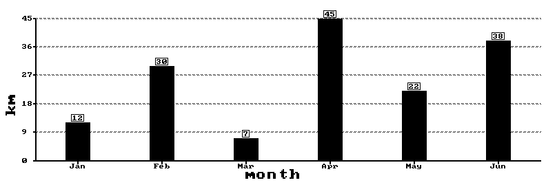
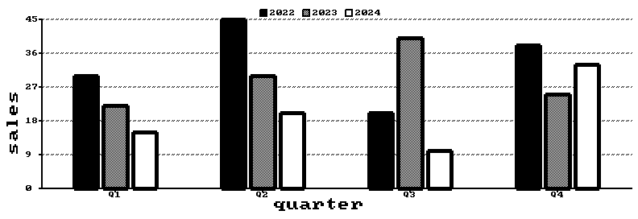
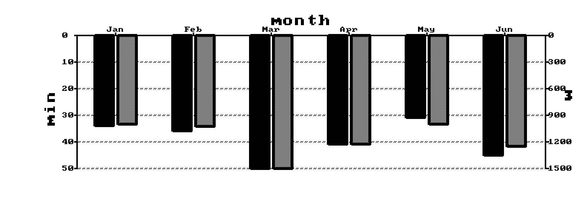
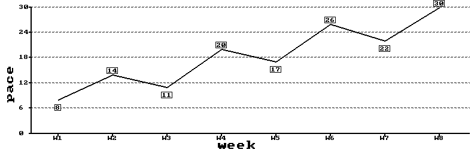
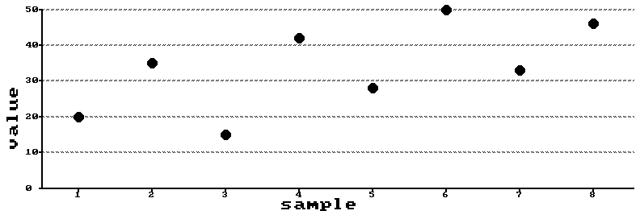
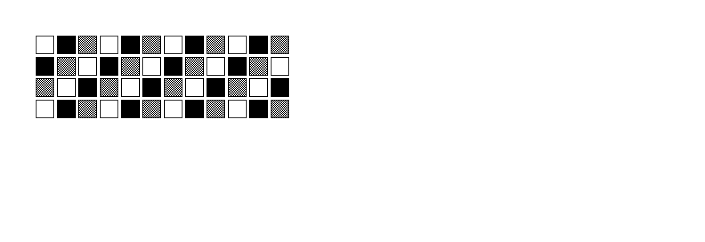

# ChartLib

> A small, dependency-free **C library for drawing charts on e-paper displays** — bars, grouped bars, dual-axis, lines and heatmaps, rendered on a 1 bit-per-pixel framebuffer.

Built and tested on a **CrowPanel ESP32 E-Paper 5.79"**, but the graphics layer is pure C with **no hardware dependencies**: it draws into a `uint8_t` framebuffer that you then hand to any display driver.

## Gallery

*Bar chart — single series with value labels*


*Grouped bars — multiple series with a legend*


*Dual-axis bar chart — two series, two independent y-axes, with a legend*


*Line chart — with value labels*


*Scatter chart — one filled dot per value*


*Frequency heatmap — a grid of white / gray / black cells*


All the charts above are produced by the runnable programs in [`examples/`](examples).

## Features

- **Charts**: bar, grouped bars, dual-axis bar, line, scatter, frequency heatmap *(pie chart is experimental)*
- **Orientation**: put the x-axis at the **bottom** (`ORIENT_BOTTOM_AXIS`) or at the **top** (`ORIENT_TOP_AXIS`)
- **Legends** for multi-series charts, with swatches matching the series colors
- **Primitives**: pixels, lines (any angle, via Bresenham), rectangles, circles, filled shapes
- **Text**: built-in 8×8 font with scaling and 0/90/180/270° rotation
- **Three "colors" on black & white**: white, black, and **gray simulated with dithering** — so you can tell series apart without real color
- **Line styles**: solid, dashed, dotted; configurable thickness
- **Axes**: titles, ticks, value labels, dashed gridlines
- **Pure C, zero dependencies** — runs on a PC (for testing) and on microcontrollers

## Installation

Copy three files into your project:

```
chart.c   chart.h   font8x8_basic.h
```

That's it — no build system, no external libraries.

## Quick start

```c
#include "chart.h"
#include <string.h>

uint8_t framebuffer[STRIDE * HEIGHT];   // 1 bit-per-pixel buffer

int main(void) {
    memset(framebuffer, 0, sizeof framebuffer);   // clear to white

    char  *labels[] = {"Jan", "Feb", "Mar", "Apr"};
    float  values[] = {12, 30, 7, 45};

    AxisConfig axis = {
        .thickness = 2, .title_size = 2,
        .x_title = "month", .y_title = "km",
        .y_steps = 5, .dash_line = true
    };
    BarChartConfig cfg = {
        .x0 = 8, .x1 = 784, .y0 = 12, .y1 = 262,
        .values_label = true,
        .axisConfig = axis
    };

    draw_bar_chart(framebuffer, &cfg, labels, values, 4, ORIENT_BOTTOM_AXIS);

    // now send `framebuffer` to your display, or save it for testing:
    save_pbm("output.pbm", framebuffer);
    return 0;
}
```

The `x0, x1, y0, y1` you pass are the **outer bounds** of the chart: titles, ticks,
labels and the legend are all drawn *inside* that box, so nothing spills past the
rectangle you asked for.

Colors and line styles use named constants, e.g. `COLOR_BLACK`, `COLOR_GRAY`, `LINE_DASHED`.

## Examples

Each chart in the gallery has a matching program in [`examples/`](examples). Build and run one from the repo root:

```bash
gcc examples/multi_bar_chart.c chart.c -o multi_bar && ./multi_bar   # -> multi_bar.pbm
```

| Example | Chart |
|---------|-------|
| [`bar_chart.c`](examples/bar_chart.c) | bar chart with value labels |
| [`multi_bar_chart.c`](examples/multi_bar_chart.c) | grouped bars + legend |
| [`double_axis_chart.c`](examples/double_axis_chart.c) | dual-axis bars + legend |
| [`line_chart.c`](examples/line_chart.c) | line chart with value labels |
| [`scatter_chart.c`](examples/scatter_chart.c) | scatter chart with filled dots |
| [`freq_chart.c`](examples/freq_chart.c) | frequency heatmap |

## On a PC (development & testing)

The library ships with `save_pbm()`, which writes the framebuffer to a
[PBM image](https://en.wikipedia.org/wiki/Netpbm) you can open in any viewer:

```bash
gcc main.c chart.c -o test && ./test   # produces output.pbm
```

This is the fast dev loop: draw, save, look — no hardware needed.

## On Arduino / ESP32

The graphics layer stays hardware-agnostic. On the device you:

1. draw into your framebuffer with the library;
2. copy it into the display driver's buffer (handling the panel's pixel format);
3. refresh the display.

> **Note:** the `.ino` is compiled as C++. Since colors, line styles and
> orientation are typed enums, pass the **names** (`COLOR_BLACK`, `LINE_DASHED`,
> `ORIENT_BOTTOM_AXIS`), not raw integers.

## API overview

| Function | Description |
|----------|-------------|
| `draw_bar_chart` | vertical bar chart |
| `draw_multi_bar_chart` | grouped bars (multiple series) |
| `draw_double_axis_bar_chart` | two series on two independent y-axes |
| `draw_line_chart` | line chart |
| `draw_scatter_chart` | scatter chart (filled dots) |
| `draw_freq_chart` | frequency heatmap (grid of cells) |
| `draw_pie_chart` | pie chart *(experimental)* |
| `set_pixel`, `draw_line`, `draw_rect`, `fill_rect`, `draw_circle`, `fill_circle` | drawing primitives |
| `draw_char`, `draw_text` | text with scaling and rotation |

The bar, grouped-bar, dual-axis, line and scatter functions take an `Orientation` as their last argument.
Every public function and config struct is documented in
[`chart.h`](chart.h) (Doxygen style).

## License

[MIT](LICENSE) © Matteo Lussana

The bundled 8×8 font (`font8x8_basic.h`) is by Daniel Hepper and is released
into the **public domain**.
